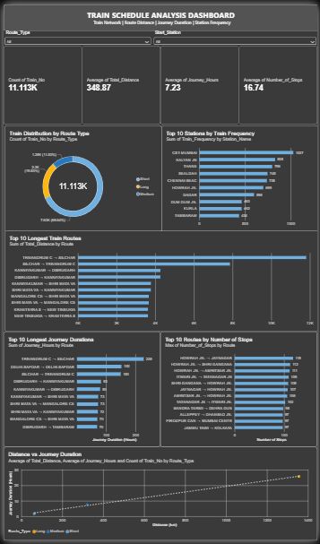

# 🚆 Train Schedule Management System

A data-driven **Train Schedule Management System** combining a Python-based Train Enquiry System with an interactive **Power BI management dashboard** for exploring and analyzing train schedules, routes, stations, journey duration, distance, and stops.

---

## 📌 Project Overview

This project consists of two main components:

### 🐍 Python Train Enquiry System

A menu-driven application built using **Python and Pandas** that allows users to:

- Search trains by source and destination
- Search trains by train number
- Find matching stations
- View available stations
- View train schedule details
- Display journey duration

### 📊 Power BI Management Dashboard

An interactive dashboard designed to monitor and analyze:

- Train schedule information
- Train distribution by route type
- Station-wise train frequency
- Longest train routes
- Longest journey durations
- Number of stops
- Distance vs. journey duration

---

## 🛠️ Tools & Technologies

- Python
- Pandas
- Power BI
- Data Transformation
- Data Visualization

---

## 🔄 Project Workflow

```text
Train Schedule Dataset
        ↓
Python / Pandas
        ↓
Data Transformation
        ↓
Power BI
        ↓
Interactive Management Dashboard
        ↓
Train Schedule Insights
```

---

## 📊 Power BI Dashboard

The Power BI dashboard provides an interactive view of the train schedule data.

### Key Metrics

| Metric | Value |
|---|---:|
| Total Train Journeys | 11.13K |
| Average Total Distance | 348.87 km |
| Average Journey Duration | 7.23 hours |
| Average Number of Stops | 16.74 |

### Dashboard Analysis

- Train distribution by route type
- Top 10 stations by train frequency
- Top 10 longest train routes
- Top 10 longest journey durations
- Top 10 routes by number of stops
- Distance vs. journey duration

### Dashboard Filters

- Route Type
- Start Station

---

## 🐍 Python Train Enquiry System

The Python application provides a menu-based train enquiry system.

### Features

- Search trains by source and destination
- Search trains by train number
- Find matching station names
- Show all available stations
- View train schedule details
- Display journey duration

### Train Details

- Train Number
- Source Station
- Destination Station
- Departure Time
- Arrival Time
- Total Distance
- Number of Stops
- Route Type
- Journey Duration

---

## 📸 Dashboard Preview



---

## 📂 Project Files

```text
train-schedule-management-system/
│
├── Train_Enquiry_System.py
├── Train Schedule Analysis Dashboard.pbix
└── README.md
```

---

## ▶️ How to Run the Python Application

### Install Pandas

```bash
pip install pandas
```

### Run the Application

```bash
python Train_Enquiry_System.py
```

### Available Options

```text
1. Search trains by route
2. Search train by train number
3. Show all stations
4. Exit
```

---

## 📊 How to View the Power BI Dashboard

1. Download the `.pbix` file from this repository.
2. Open it using **Power BI Desktop**.
3. Use the available filters and visuals to explore the train schedule data.

---

## 🚀 Future Enhancements

- Web-based train enquiry interface
- Real-time train status
- Live railway data integration
- Online deployment

---

## 👩‍💻 Author

**Sejal Patil**

Aspiring Data Analyst

**Power BI | Python | SQL | Excel | Data Visualization**
